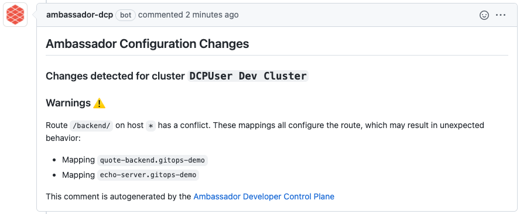
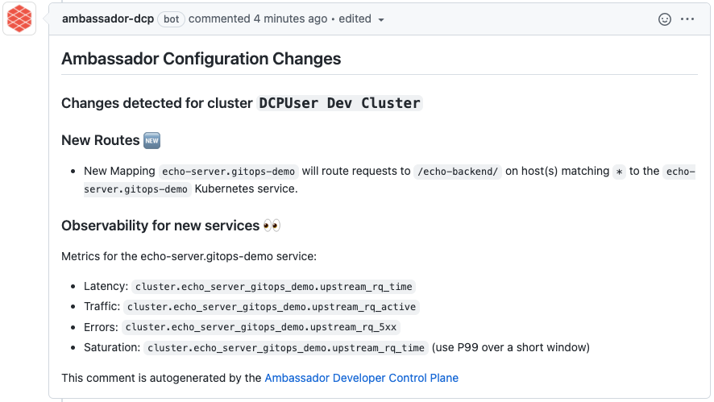

import Alert from '@material-ui/lab/Alert';

<div class="docs-article-toc">
<h3>Contents</h3>

* [1. Connect your cluster to Ambassador Cloud](#1-connect-your-cluster-to-ambassador-cloud)
* [2. Fork the demo repository](#2-fork-the-demo-repository)
* [3. Apply the manifests in your cluster and see the service being reported in the service catalog](#3-apply-the-manifests-in-your-cluster-and-see-the-service-being-reported-in-the-service-catalog)
* [4. Configure GitHub integration](#4-configure-github-integration)
* [5. Create a Pull Request](#5-create-a-pull-request)
* [6. Review & merge Pull Request](#6-review--merge-pull-request)
* [What's Next?](#whats-next)

</div>

# Automated Configuration Analysis with Ambassador Cloud

Edge Stack and Emissary-ingress are managed declaratively. This approach lends itself well to a [GitOps workflow](../../../../../docs/edge-stack/latest/topics/concepts/gitops-continuous-delivery/). Traditionally, adopting a GitOps workflow requires an extensive amount of engineering. With the Ambassador Developer Control Plane, you can quickly and easily adopt a GitOps workflow without any custom engineering.

This quick start walks you through how to configure Edge Stack or Emissary-ingress with automated configuration analysis, integrating checks into your GitOps pull request workflow. The automated configuration analysis will detect and resolve configuration issues _before_ your changes go live.

<Alert severity="warning">
  You must use Edge Stack or Emissary-ingress 2.2 or later to enable automated configuration analysis.
</Alert>

## 1. Connect your cluster to Ambassador Cloud

<Alert severity="info">
  If you followed the <a href="/docs/edge-stack/latest/tutorials/getting-started/">Edge Stack quick start</a>, you can skip this step and begin the second step, <a href="#2-fork-the-demo-repository">Fork the demo repository</a>.
</Alert>

1. Log in to [Ambassador Cloud](https://app.getambassador.io/cloud/) with your preferred identity provider.

2. Click **Add Services** at the top, then click **Connection Instructions** in the `Connect your installation` section.

3. Follow the prompts to name the cluster and click **Generate a Cloud Token**.

4. Follow the prompts to install or configure either Edge Stack or Emissary-ingress 2.2 or later with a cloud token into your Kubernetes cluster.

   If you do not have the latest version installed, you can:

   * [Install the latest version of Edge Stack](/docs/edge-stack/latest/topics/install/)
   * [Upgrade Edge Stack to the latest version](/docs/edge-stack/latest/topics/install/upgrading/)

5. When the installation completes, services, environments and clusters are visible in Ambassador Cloud.

<Alert severity="success"><b>Victory!</b> All the Services running in your cluster are now listed in Service Catalog!
You should now be able to see all running services in your cluster at <a href="https://app.getambassador.io/cloud/services" target="_blank">https://app.getambassador.io/cloud/services</a> </Alert>

## 2. Fork the demo repository

Fork the <a href="https://github.com/datawire/a8r-gitops-example" target="_blank">demo repository</a>, then clone your fork into your local workstation. This repository contains a Kubernetes service that you will add to the Service Catalog.

## 3. Apply the manifests in your cluster and see the service being reported in the service catalog

From the root of your local `a8r-gitops-example` demo repository clone, apply the Kubernetes manifests to your cluster.

```
kubectl create namespace gitops-demo && \
kubectl apply -n gitops-demo -f ./manifests
```

This will create a `Deployment`, `Service`, and `Mapping` in the `gitops-demo` namespace in your cluster. All resources applied in this guide can be removed by running `kubectl delete namespace gitops-demo` when you're done with the quickstart.

<Alert severity="info">The <a href="https://app.getambassador.io/cloud/services" target="_blank">Service Catalog</a> should display information about the quote service!</Alert>

## 4. Configure GitHub integration

1. Navigate to the <a href="https://app.getambassador.io/cloud/settings/teams" target="_blank">Teams Settings page</a> in Ambassador Cloud.

2. Click the **INTEGRATIONS** button to navigate to the Integration settings, then click the **CONFIGURE** GitHub settings button.

3. Click **MANAGE PERMISSIONS** button. You will be taken to github.com and asked to choose which account you want to install Ambassador DCP.

4. Select the account which contains the forked `a8r-gitops-example` demo repository.

    

    Configure the installation for the demo repository:

    

    After clicking **Install**, you will be directed back to Ambassador Cloud.

5. Once back in Ambassador Cloud, click the **CONFIGURE** GitHub settings button once more and find the `a8r-gitops-example` demo repository in the list of repositories. Click **ENABLE INTEGRATIONS**.

6. Configure Ambassador Cloud to access your cluster information and Kubernetes manifests from Git.

    For the `manifest` text box, enter the relative path to your Kubernetes manifest files in your repository. For the demo repository, the [manifests](https://github.com/datawire/a8r-gitops-example/tree/main/manifests) live in the `/manifests` directory.

    Select the cluster you initialized in step 1 from the `cluster` dropdown.

7. Click on the **UPDATE REPOSITORY SETTINGS** button. This will trigger Ambassador Cloud to create a pull request with the information you just entered into your forked demo `a8r-gitops-example` repository. The pull request will add a file named `.a8r.yaml` to the root of your repository, and the contents will look something like this:

    ```
    k8s_config:
    - manifest_path: /manifests/
      cluster_info:
        cluster_id: 01234567-89ab-cdef-0123-456789abcdef
        cluster_name: My Awesome Cluster
    ```

8. Merge the pull request to the main branch of the `a8r-gitops-example` repository.

<Alert severity="success"><b>Congrats!</b> Your demo repository is now configured to receive pull request feedback from the automated configuration analysis.</Alert>

## 5. Create a Pull Request

Now that your repository is configured to receive feedback from the Ambassador Cloud, let's create a pull request that modifies the Kubernetes resources in the `a8r-gitops-example` demo repository.

First, navigate to the root of your local `a8r-gitops-example` demo repository and run `git pull` to fetch the newly merged `.a8r.yaml` from your global `a8r-gitops-example` demo repository.

Then, create a new YAML file named `echo-service.yaml` in the `manifests` directory and paste the YAML below:

```yaml
apiVersion: apps/v1
kind: Deployment
metadata:
  name: echo-server
  namespace: gitops-demo
spec:
  replicas: 1
  selector:
    matchLabels:
      app: echo-server
  template:
    metadata:
      labels:
        app: echo-server
    spec:
      containers:
        - name: echo-server
          image: jmalloc/echo-server
          ports:
            - name: http-port
              containerPort: 8080
---
apiVersion: v1
kind: Service
metadata:
  name: echo-server
  namespace: gitops-demo
spec:
  ports:
    - name: http-port
      port: 80
      targetPort: http-port
      protocol: TCP
  selector:
    app: echo-server
---
apiVersion: getambassador.io/v3alpha1
kind: Mapping
metadata:
  name: echo-server
  namespace: gitops-demo
spec:
  hostname: '*'
  prefix: /backend/
  service: echo-server
```

Commit and push changes to Git:

```
git checkout -b new-echo-service
git add manifests/echo-service.yaml
git commit -am 'Add new echo service' && git push -u origin new-echo-service
```

Navigate to GitHub to create a pull request for your change. Make sure the target repository is in your git fork, not `datawire`.

## 6. Review & merge Pull Request

When you create a new pull request that changes your configuration, Ambassador Cloud will be automatically notified. The configuration change that you make is compared to your existing (runtime) configuration change, and the implications of this change are analyzed. Ambassador Cloud will post a comment, analyzing the consequences of merging the pull request into your main branch.

In this example, the automated configuration analysis detects a conflict on the `/backend` route, as multiple `Mappings` point to the same route.



In this case, we didn't intend to create a route conflict, so we'll make a change to fix this particular problem.

In `manifests/echo-service.yaml`, edit the prefix for the `echo-service` `Mapping`, so that it doesn't conflict with the `quote` service:

```diff
 metadata:
   name: echo-server
   namespace: gitops-demo
 spec:
   hostname: '*'
-  prefix: /backend/
+  prefix: /echo-backend/
   service: echo-server
```

Commit and push changes:
```
git add manifests/echo-service.yaml
git commit -am 'Update echo service to avoid route conflicts' && git push -u origin HEAD
```

Ambassador Cloud will update the Pull Request comment, noting that the new route is entirely new and does not conflict with other routes!


<Alert severity="success"><b>Congratulations!</b> You've just avoided utter disaster in production. </Alert>

## What's Next?

See the [reference](../reference) for more information on automated configuration analysis with Ambassador Cloud.
