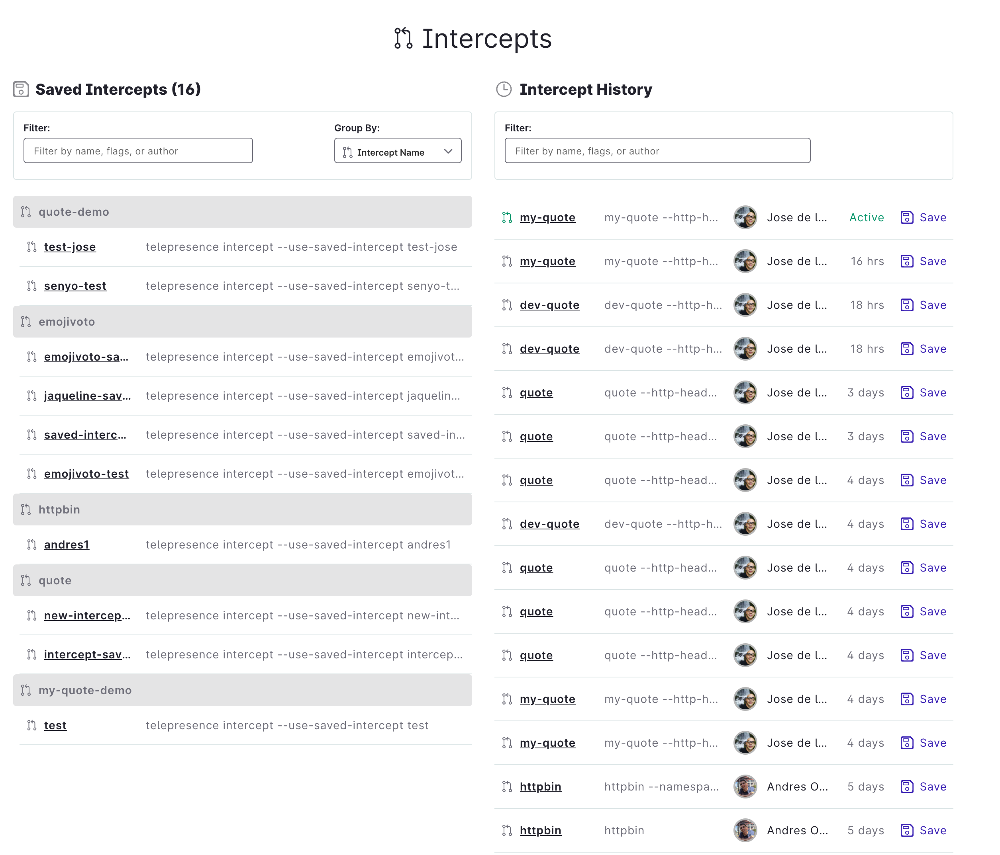

# Saved Telepresence intercepts

The Ambassador Cloud Intercepts page gives you access to your intercept history and allows save previous intercept configurations. Saved intercepts can be shared with other team members to streamline your development cycle and collaborate more easily.

## Prerequisites

To use the saved intercepts feature, you need:

1. A [local installation](../../../telepresence/latest/install/index). of Telepresence version 2.7.0 or later.
1. An Ambassador Cloud account.
1. Access to a Kubernetes cluster.

Telepresence releases prior to version 2.7.0 don’t support the saved intercepts feature. If you are using an older version of Telepresence, visit the [upgrade page](../../../telepresence/latest/install/upgrade) to learn how to update to the current version.

## Creating and saving intercepts

Intercept configurations are automatically saved in the Intercept History tab on the Intercepts page. To save an intercept and share it with team members, follow the steps below.

1. Run `telepresence login` to authenticate yourself in Ambassador Cloud.
1. Run `telepresence connect` to connect Telepresence.
1. Intercept traffic to a service running in your Kubernetes cluster by creating an intercept. For example:
   ```bash
   telepresence intercept voting --port 8081:8080 --namespace emojivoto --http-header x-telepresence-intercept-id=test-user-1
   ```
   Each time you create an intercept like this, it is logged in Ambassador Cloud's Intercept History.
1. Go to the Ambassador Cloud [Intercept History page](https://app.getambassador.io/cloud/saved-intercepts/history) and click on the intercept you just created. 
   Enter a name for the intercept and click **Create**.
1. The incercept is now available in the [Saved Intercepts page](https://app.getambassador.io/cloud/saved-intercepts/saved-intercept)




## Using saved intercepts

Once an intercept has been saved, you can reuse it and share it with team members. You can also create more intercepts with the same set of arguments as in the original saved intercepts by with the following command:

```bash
telepresence intercept --use-saved-intercept <saved-intercept-name>
```

This command fetches the intercpet configuration of the saved intercept and uses it to run a new intercept. This way, you don't need to remember all the arguments required to intercept a service in a particular cluster.
sence CLI version v2.7.0 or later.

##  Managing Saved Intercepts

In the [Telepresence Saved Intercepts page on Ambassador Cloud](https://app.getambassador.io/cloud/saved-intercepts/saved-intercept), you can see the list of saved intercepts created by any Ambassador team member. For each of these intercepts, you can:

- inspect its author, creation date and flags.
- delete the saved intercept.
- see the command as it would be entered in the CLI.


